---
# Egypt Multi-Asset AI Portfolio Optimization and Decision-Support System

**Egypt University of Informatics (EUI)**  
**Faculty of Engineering**  
**Data Science Methodology — CSE271**  
**Spring 2026**

| | |
|---|---|
| **Project Title** | AI-Driven Multi-Layer Portfolio Optimization and Decision-Support System for the Egyptian Market |
| **Team Members** | Ziad Ahmed Rabie (23-101292); Farah Sultan (23-101224); Moataz Ashraf (23-101290); Mostafa Ibrahim (24-101476); Hassan Ahmed (23-101330); Mohamed Allam (23-101291) |
| **Course** | CSE271 — Data Science Methodology |
| **Submission** | Technical Report (Final) |
| **Report Date** | May 2026 |

---

## 1. Abstract

The Egyptian financial market presents a structurally challenging investment environment characterized by persistent inflation, episodic currency devaluation, elevated sovereign yields, and fragmented liquidity across asset classes. Static allocation rules—such as fixed domestic equity weights or textbook 60/40 structures—frequently fail to preserve real purchasing power when macro shocks compress equity risk premia and re-price hard assets in EGP terms. This report documents the design, implementation, and empirical validation of an **AI-driven, multi-layer portfolio optimization and decision-support system** tailored to EGP-denominated investors.

The platform integrates five core investable sleeves—**EGX30**, **EGX100**, **local Gold**, **91-day Egyptian T-Bills**, and the **Egyptians Real Estate Fund (EGREF)**—within a reproducible Python engine (`src/`) that publishes auditable outputs to `outputs/intelligence_report.json` and companion visualizations. A **strategic layer** forecasts 63-day forward returns using walk-forward ensembles (Ridge, Random Forest, SVR) with Bayesian shrinkage toward historical anchors when out-of-sample skill is weak. A **tactical layer** classifies short-horizon regimes (−1/0/+1) via Logistic Regression, RBF-SVM, and XGBoost, applying confidence dampeners (class imbalance, fold instability, calibration error, ensemble disagreement) and **volatility-targeted position sizing**. **Mean–variance optimization** selects a long-only tangency (maximum Sharpe) portfolio under institutional guardrails, while **Student-t parametric** and **block-bootstrap Monte Carlo** simulations stress-test tail risk.

Key empirical findings from the latest intelligence run (engine v0.3.0, seed 7) include: (i) **negative EGX30–Gold correlation** (ρ ≈ -0.365), supporting inflation-hedge diversification; (ii) an **Optimal strategic allocation** of EGX30 42.82%, Gold 57.18% with ex-ante Sharpe 0.5854; (iii) tactical **neutral signal** (confidence 7.8%) under elevated realized volatility (22.04% vs target 18.00%); and (iv) walk-forward backtest (Jan–May 2026) **Optimal CAGR 66.33%** vs EGX30 87.52% and local 60/40 59.81%. We recommend deploying the tangency portfolio as a strategic anchor, retaining tactical de-risking, and treating EM-imputed histories as model-derived where Gold/REIT coverage is thin.

---

## 2. Introduction

### 2.1 Background and Context

Emerging markets differ from developed economies along dimensions that directly invalidate passive Western allocation templates. In Egypt, domestic investors face a **macroeconomic triad**: (1) **structural inflation** eroding real returns on nominally positive cash instruments; (2) **currency devaluation episodes** that re-price EGP assets abruptly and can decouple nominal equity performance from USD-real wealth; and (3) **monetary tightening cycles** by the Central Bank of Egypt (CBE) that elevate T-Bill yields above 20% annually, mechanically raising the hurdle rate for risk assets.

The Egyptian Exchange (EGX) exhibits **high beta, fat-tailed returns, and volatility clustering**—patterns confirmed in our exploratory notebooks and Power BI dashboards. Simultaneously, **local Gold (EGP/gram)** and sovereign bills have historically provided defensive ballast, though correlations are regime-dependent and must be re-estimated rather than assumed static. Real-estate exposure via **EGREF** introduces appraisal smoothing (high zero-return concentration) that understates economic risk unless corrected.

**Historical context (2015–2026):** Our panel spans the 2016 devaluation episode, 2020 pandemic volatility, the 2022–2023 global inflation shock, and the 2024+ macro adjustment cycle with structurally higher T-Bill auction yields. Nominal EGX30 appreciation following devaluations often masks **USD-real underperformance**, motivating the platform’s synthetic USD/EGP deflator and `usd_real_metrics` in backtests.

**Policy rate channel:** When 91-day yields exceed ~25% annually, compounding risk-free carry becomes a genuine allocation competitor—not merely a Sharpe denominator. Optimizers that mis-specify bill returns (e.g., using raw yield deltas) systematically under-allocate defensive sleeves; our CBE-anchored OU feed corrects this bias.

Artificial intelligence and quantitative data science enable **non-linear pattern extraction**, **regime-aware segmentation**, and **leakage-safe validation**—capabilities essential when linear factor models underfit localized microstructure. This project operationalizes those methods in an institutional-grade pipeline with explicit provenance, anti-leakage chronology, and JSON audit trails suitable for capstone submission and stakeholder review.

### 2.2 Literature Review

**Modern Portfolio Theory (MPT)** (Markowitz, 1952) formalizes mean–variance trade-offs and the **efficient frontier**—the set of portfolios maximizing expected return for a given volatility. **CAPM** (Sharpe, 1964) links systematic risk to expected return and popularized the **Sharpe ratio** as the canonical risk-adjusted performance metric. Practical MVO is fragile: small estimation errors in μ and Σ cause unstable weights (“error maximization”; Black & Litterman, 1992).

**Tactical Asset Allocation (TAA)** (Faber, 2007) permits short-horizon deviations from strategic weights to exploit momentum or reduce drawdowns. Grinold & Kahn (1999) extend active management theory with information ratios and tracking error budgets—concepts echoed in our `active_vs_local_60_40` diagnostics.

In machine learning finance, **random forests** (Breiman, 2001) and **gradient boosting** (Chen & Guestrin, 2016) address non-linear interactions among technical indicators. Gu, Kelly, and Xiu (2020) demonstrate that ML models can outperform linear factor models out-of-sample when regularized and properly validated. **Advances in Financial Machine Learning** (López de Prado, 2018) stresses purged cross-validation, sample weighting, and meta-labeling—principles we approximate via walk-forward folds, confidence dampeners, and tactical position sizing.

For incomplete panels, **EM imputation** under multivariate normality (Dempster, Laird, & Rubin, 1977; Schafer, 1997) offers a principled alternative to listwise deletion, though imputed segments must be flagged as model-derived. Chan (2013) and Narang (2013) document practical algorithmic trading pitfalls (lookahead, survivorship, capacity) that inform our governance layer.

Egyptian macro studies (IMF, 2023; CBE, 2024) underscore devaluation–inflation linkages motivating explicit Gold and T-Bill sleeves. Dixon, Halperin, and Bilokon (2020) survey ML in derivatives and fixed income—relevant as Egyptian rates dominate opportunity cost for equity risk.

#### 2.2.1 Research Gap

Few published studies integrate **EGX equities, EGP gold, sovereign bills, and a listed real-estate fund** within a unified, leakage-controlled ML allocation stack. This project contributes an open, reproducible implementation with explicit imputation provenance and JSON auditability—bridging academic capstone requirements and practitioner decision support.

### 2.3 Project Objectives

1. **Strategic:** Forecast quarterly (63-day) capital market assumptions; construct long-only tangency portfolios; publish efficient-frontier and Monte Carlo diagnostics.
2. **Tactical:** Classify daily regimes; fuse momentum, technicals, and classifier ensembles; output confidence-scaled position sizes via volatility targeting.
3. **Optimization:** Enforce long-only, fully invested solutions with joint **EGX30+EGX100 caps** and documented mandate bounds for comparison.
4. **Validation:** Walk-forward backtests with `train_end < test_start` assertions, transaction costs (12 bps), and benchmark panels (EGX30, T-Bills, local 60/40).
5. **Visualization:** Jupyter EDA, Power BI dashboards, programmatic Matplotlib outputs, and a Next.js interactive platform consuming `intelligence_report.json`.

---

## 3. Materials and Methods

### 3.1 Data Description and Sourcing

#### 3.1.1 Sources and Collection Protocol

Following the validated protocol in our interim report (`DATA_SCIENCE_Report (1).pdf`), historical data were collected from:

| Source | Role | Rationale |
|--------|------|-----------|
| **investing.com** | Primary analytical dataset | Standardized CSV exports, 2015–2026 coverage, minimal preprocessing |
| **EGX Official Portal** | Validation | Index composition and trading calendar checks |
| **Yahoo Finance** | Validation / benchmark | Cross-checks for Gold/EGP and S&P 500 benchmark |

**Collection parameters:** daily frequency; EGP denomination; window **2015-01-01 to 2026-05-01**; trading-day alignment to EGX calendar.

#### 3.1.2 Investable Universe (Production System)

The live optimizer (`STRATEGIC_UNIVERSE` in `src/config/settings.py`) uses five assets:

| Asset | Class | Role | Observations (latest run) |
|-------|-------|------|---------------------------|
| **EGX30** | Large-cap equity index | Core growth / liquidity proxy | 2734 rows (2015-02-03–2026-04-30) |
| **EGX100** | Broad equity index | Mid/large diversification | 1286 rows; history ends 2020-05-07 |
| **Gold** | Commodity / FX hedge | Inflation & devaluation hedge | 539 rows from 2024-06-18 |
| **TBills** | Cash / risk-free proxy | Carry anchor (CBE schedule) | 3033 rows |
| **EgyptiansRealEstateFund** | Listed real-estate fund | Real-asset proxy | 289 rows; high zero-return share |

**Supplementary EDA assets** (notebooks under `EDA/`): Palm Hills, SODIC, TMG—used for single-name equity diagnostics but **not** in the strategic optimizer universe.

**Primary investing.com endpoints (historical daily):**

| Asset | URL |
|-------|-----|
| EGX30 | https://www.investing.com/indices/egx-30-historical-data |
| EGX100 | https://www.investing.com/indices/egx-100-historical-data |
| Gold (EGP/g) | https://www.investing.com/currencies/gau-egp |
| 1Y T-Bills | https://www.investing.com/rates-bonds/egypt-1-year-bond-yield-historical-data |
| Egyptians Real Estate Fund | https://www.investing.com/equities/egyptians-real-estate-fund |

**Egyptian 91-day T-Bill yield schedule encoded in `settings.py` (annualized, decimal):**

| Years | Yield |
|-------|-------|
| 2015 | 11.5% |
| 2016 | 13.5% |
| 2017 | 19.0% |
| 2018 | 18.4% |
| 2019 | 16.5% |
| 2020 | 13.5% |
| 2021 | 13.0% |
| 2022 | 15.5% |
| 2023 | 21.5% |
| 2024 | 26.0% |
| 2025–2026 | 25.5% |

**Raw schema (pre-cleaning):** `date`, `price`, `open`, `high`, `low`, `vol`, `change_pct` (string-typed exports with comma separators and `%` suffixes).

#### 3.1.3 Panel Construction and Provenance

The loader (`src/data/loaders.py`) builds:

- `returns`: union-index observed panel (NaN where missing)
- `completed_returns`: EM-imputed panel for μ/Σ estimation
- `aligned_returns`: strict overlap subset for tactical modules

Panel window: **2015-01-26 – 2026-05-01**. Risk-free anchor: 17.61% annualized (recent T-Bill schedule).

---

### 3.2 Data Cleaning and Preprocessing

#### 3.2.1 Deterministic CSV Standardization (Legacy + Final Data)

The eleven-step reproducible workflow documented in our original report remains the foundation for `data/cleaned_data/` and `data/final_data/`:

1. Load raw CSV (immutable `raw_data/`)
2. Normalize headers (`Vol.` → `vol`, `Change%` → `change_pct`)
3. Parse dates (M/D/YYYY → datetime index)
4. Sort chronologically; filter 2015–2026
5. Drop duplicate timestamps (`keep='first'`)
6. Strip comma thousands separators; cast prices to float
7. Parse volume (`M` suffix → millions); empty → NaN
8. Parse signed daily returns from `change_pct`
9. Audit missingness per column
10. Export cleaned CSV per asset

#### 3.2.2 Production Transformations (Engine)

Beyond CSV cleaning, the live pipeline applies:

| Step | Implementation | Financial Rationale |
|------|----------------|---------------------|
| **T-Bill carry reconstruction** | `TBILL_FEED = ou_simulated` anchored to CBE piecewise yields | Raw vendor “return” column is delta-yield/252, not holding-period return—would destroy carry |
| **Geltner unsmoothing** | `EgyptiansRealEstateFund` returns | Removes appraisal lag autocorrelation (~63% zeros pre-adjustment) |
| **Winsorization ±30%** | Daily returns clipped | Prevents one-off spikes from dominating μ/Σ; training-window bounds in walk-forward |
| **EM imputation** | `em_impute_returns()` max_iter=150, tol=1e-7 | Preserves cross-asset covariance when Gold/REIT histories are short |
| **Imputation shrinkage** | If `imputed_fraction > 0.35`, μ shrunk toward cross-sectional mean | Reduces optimizer reliance on synthetic Gold/REIT segments |

**Anti-leakage:** Feature winsorization and model fitting use only training rows strictly before each rebalance date (`src/strategic/forecasting/regression.py`; `src/simulation/backtest.py`).

---

### 3.3 Feature Engineering

Per-asset frames include return lags and technical indicators (`src/tactical/technicals/`, EDA notebooks):

| Feature | Construction | Predictive intuition |
|---------|--------------|----------------------|
| `return_lag1–3` | Shifted daily returns | Short-term autocorrelation / momentum |
| `dist_to_ma5` | (Price − MA₅) / MA₅ | Mean-reversion distance |
| `macd_hist` | MACD line − signal | Trend acceleration |
| `rsi` | 14-day RSI | Overbought/oversold momentum |
| `bb_pb` | Bollinger %B | Volatility regime / band position |
| `bb_bandwidth` | Band width / MA | Vol expansion–contraction |
| `rolling_volatility` | Rolling σ (annualized) | Risk regime input |

**Strategic target:** 63-day compounded forward return. **Tactical target:** ternary labels {−1, 0, +1} from forward return quantiles (sell/hold/buy).

---

### 3.4 Exploratory Data Analysis (EDA)

#### 3.4.1 Methodology

EDA combined:

1. **Per-asset Jupyter notebooks** (`EDA/01_EDA_EGX30.ipynb` … `09_EDA_Egyptians_Real_Estate_Fund.ipynb`) implementing the **7-plot standard**: cumulative returns + volume; return distribution (histogram/KDE); class balance; feature separability (violin); feature correlation heatmap; 30-day rolling volatility; drawdown curve.
2. **`00_General_Data_Cleaning.ipynb`** for cross-sectional correlation and distributional statistics on the cleaned panel.
3. **Power BI dashboard** (three pages; screenshots in `dashboard_page_images/`).

#### 3.4.2 Cross-Sectional Findings

- **Non-normality:** Excess kurtosis on EGX30 (~4.1) and Gold (~8.1) in latest QA summary—fat tails invalidate Gaussian VaR.
- **Volatility clustering:** 30-day rolling σ spikes beyond 40% in stress years (2020, 2023 devaluation window).
- **Diversification:** EGX30–Gold correlation -0.365 supports hedge thesis; EGX30–EGX100 ρ ≈ 0.90 implies redundant equity risk if stacked without cap.
- **REIT data quality:** 63.3% zero returns and stale gaps flagged—handled via unsmoothing + high imputation fraction (91.7% imputed cells in provenance).

**Figure 1.** Power BI — Page 1: Market Overview (KPI cards, comparative volatility, rebased performance).
Figure 1 supports macro monitoring: the global date slicer rebases all assets to a common visual scale, revealing that **daily change dispersion** widens materially around devaluation windows while rebased performance races diverge between Gold and equities.

**Figure 2.** Power BI — Page 2: Exploratory Data Analysis (asset selector, price trend, RSI, MACD histogram).
Figure 2 enables security-level technical review: synchronized RSI and MACD views help practitioners distinguish **overbought momentum** from **trend exhaustion**, informing tactical overlays without re-running Python notebooks.

**Figure 3.** Power BI — Page 3: Statistical EDA & Risk Analysis (risk–return scatter, return histogram, indicator matrix).
Figure 3 condenses multi-asset risk metrics: the risk–return scatter positions each sleeve by realized volatility vs total return, while the indicator matrix highlights relative RSI/MACD/Bollinger posture via conditional formatting.

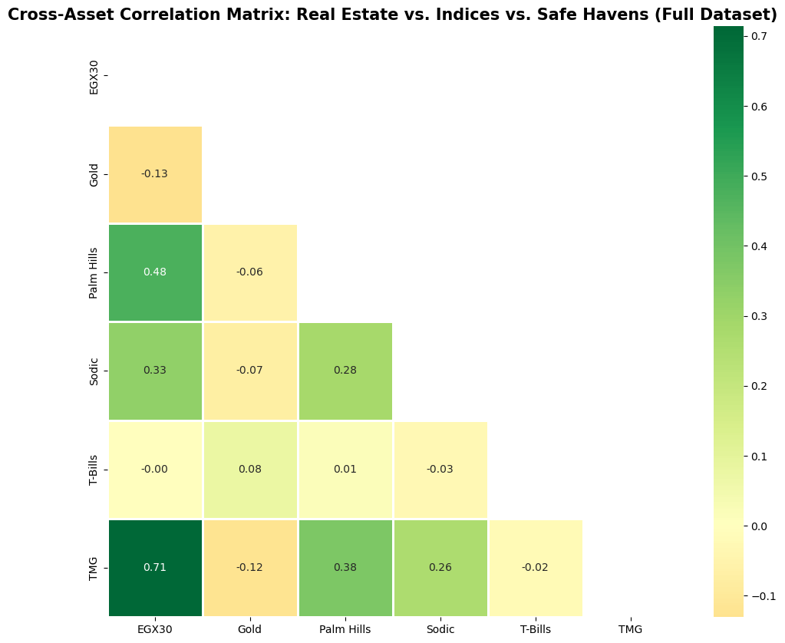

**Figure 4.** Cross-asset correlation heatmap (cleaned panel, upper-triangle mask).

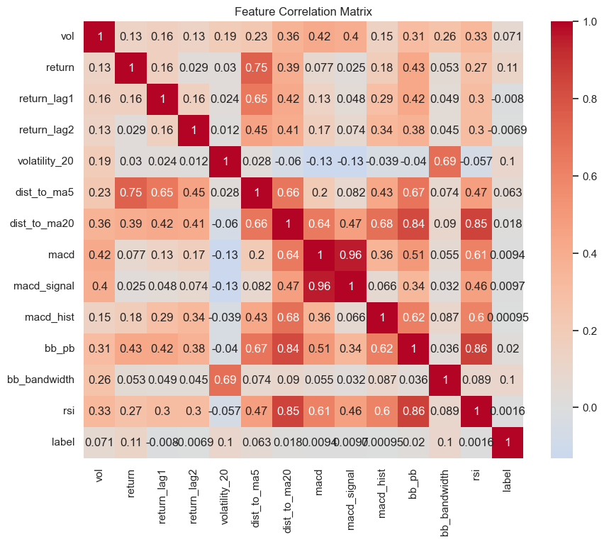

**Figure 5.** EGX30 cumulative returns with volume overlay (2015–2026).

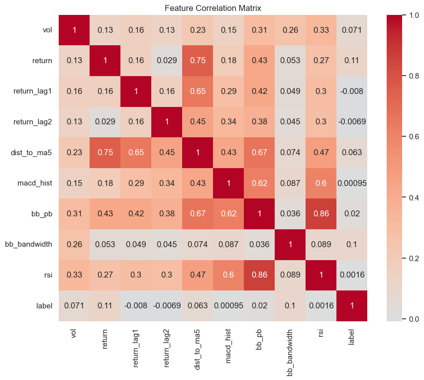

**Figure 6.** EGX30 daily return distribution (histogram + KDE) exhibiting fat tails.

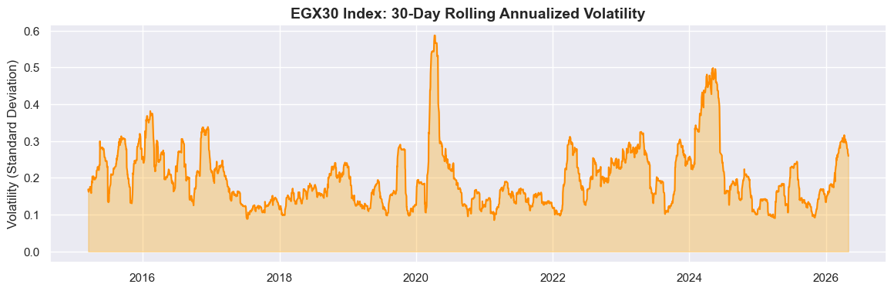

**Figure 7.** EGX30 30-day annualized rolling volatility — volatility clustering.

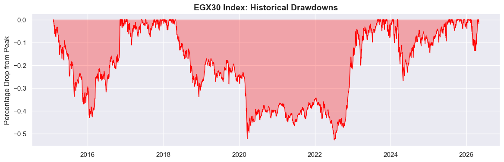

**Figure 8.** EGX30 historical drawdown profile (peak-to-trough).

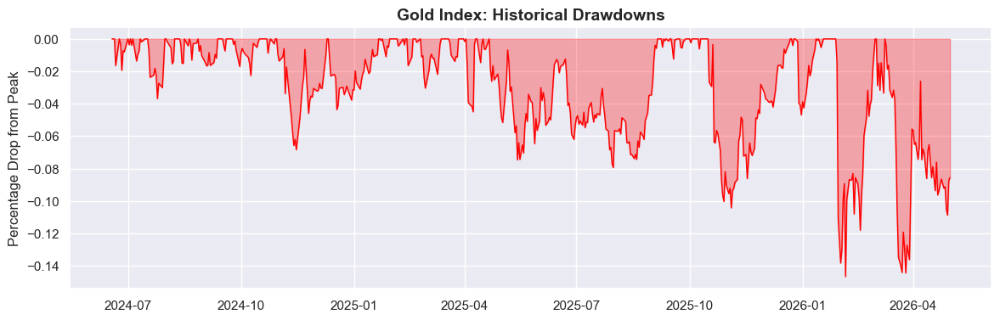

**Figure 9.** Gold (EGP) drawdown profile — comparative hedge behavior.

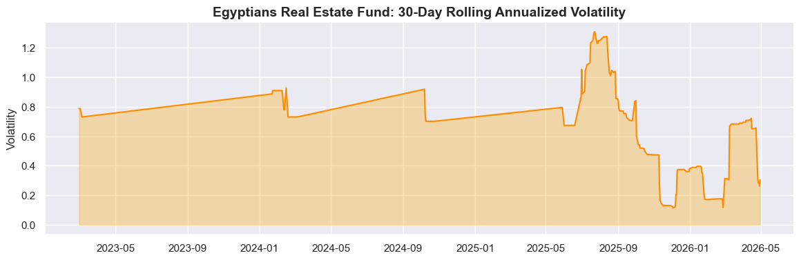

**Figure 10.** EGREF additional risk diagnostics post feature engineering.

### 3.5 Strategic Forecasting Models

**Objective:** Estimate 63-day forward returns per asset for capital market assumptions (CMAs).

**Models (walk-forward, 4 expanding folds):**

| Model | Configuration | Role |
|-------|---------------|------|
| **Ridge** | L2 penalty, standardized features | Stable linear baseline |
| **Random Forest** | `n_estimators=200`, `max_depth=8` | Non-linear interactions |
| **SVR** | RBF kernel, ε-insensitive loss | Smooth non-linear alternative |

**Ensemble:** Median of valid model 63-day predictions; **Bayesian shrinkage** toward 90-day historical median when composite skill is weak (`shrink = clip(0.50 + 0.45·skill, 0.15, 0.95)`). **Confidence** blends OOS R², MAE skill vs baseline, and directional accuracy (clipped to [0.05, 0.95]).

**Latest OOS diagnostics (median R², walk-forward):** EGX30 Ridge -0.4878319454930662; RF -0.4959422122661564; SVR -0.6670843096070161. Negative R² values indicate weak predictive skill—expected for daily financial noise—and trigger shrinkage rather than aggressive μ tilts.

**Note on interim-report metrics:** Earlier notebook experiments reported high in-sample R² for linear models; the production engine enforces **train-only winsorization** and **walk-forward folds**, producing conservative skill estimates aligned with institutional practice.

---

### 3.6 Tactical Machine Learning Layer

**Classification setup:** Three-class labels {−1, 0, +1} from forward return quantiles.

| Classifier | Key hyperparameters | Purpose |
|------------|---------------------|---------|
| **Logistic Regression** | `class_weight='balanced'`, max_iter=1000 | Interpretable baseline probabilities |
| **SVM (RBF)** | `C=1.2`, `probability=True` | Non-linear decision boundaries |
| **XGBoost** | `n_estimators=200`, `lr=0.05`, `max_depth=5` | High-capacity tabular learner |

**Confidence governance:** Penalties for class imbalance, fold F1 instability, calibration error, and ensemble disagreement. **Volatility targeting:** `position_size = clip(target_vol / realized_vol, 0.20, 1.50)`.

**Regime detection:** `bull_trend`, `bear_trend`, `high_volatility`, etc., from rolling vol, drawdown, and trend filters (`src/tactical/market_regimes/regime_detector.py`).

**[INSERT FIGURE 11: ROC curves per classifier (EGX30 tactical holdout) — export from notebook or add to report_plots.py]**

**Figure 11.** ROC curves per classifier (EGX30 tactical holdout) — export from notebook or add to report_plots.py

**[INSERT FIGURE 12: Confusion matrix heatmap (ensemble tactical classifier, latest holdout)]**

**Figure 12.** Confusion matrix heatmap (ensemble tactical classifier, latest holdout)

---

### 3.7 Portfolio Optimization

**Framework:** Long-only mean–variance optimization via SLSQP (`src/strategic/optimization/efficient_frontier.py`).

**Primary mandate:** **Tangency portfolio (maximum Sharpe)** — `OPTIMAL_PORTFOLIO_KEY = "Optimal"`.

Objective (annualized):

\[
\max_w \frac{w^T \mu - R_f}{\sqrt{w^T \Sigma w}}
\]

**Constraints:**

- \(w_i \ge 0\) (no short sales)
- \(\sum w_i = 1\)
- **Joint equity cap:** \(w_{EGX30} + w_{EGX100} \le 0.65\)
- **Advisory mandate bounds** (`PROFILE_BOUNDS`) documented for compliance comparison; tangency solution may violate floors when data warrant

**Reference portfolios:** minimum variance, equal risk contribution, MV utility — published under `strategic_diagnostics.reference_portfolios`.

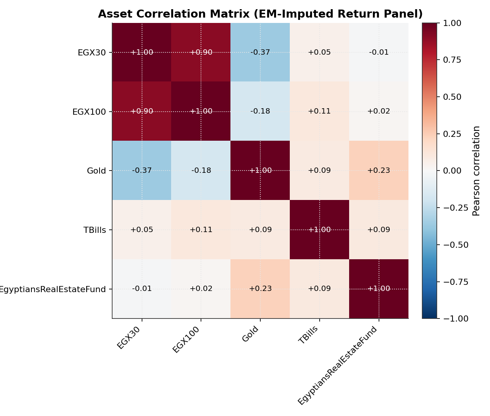

**Figure 13.** Strategic asset correlation heatmap (completed-return panel).

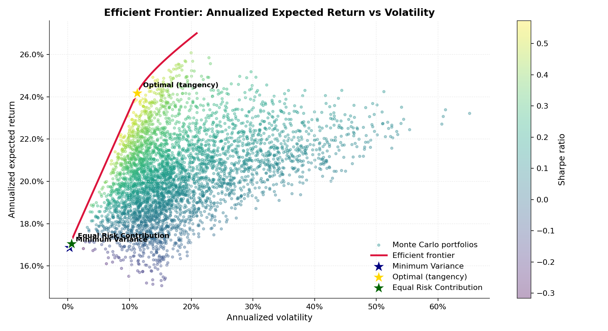

**Figure 14.** Simulated efficient frontier with tangency (★) and reference portfolios.

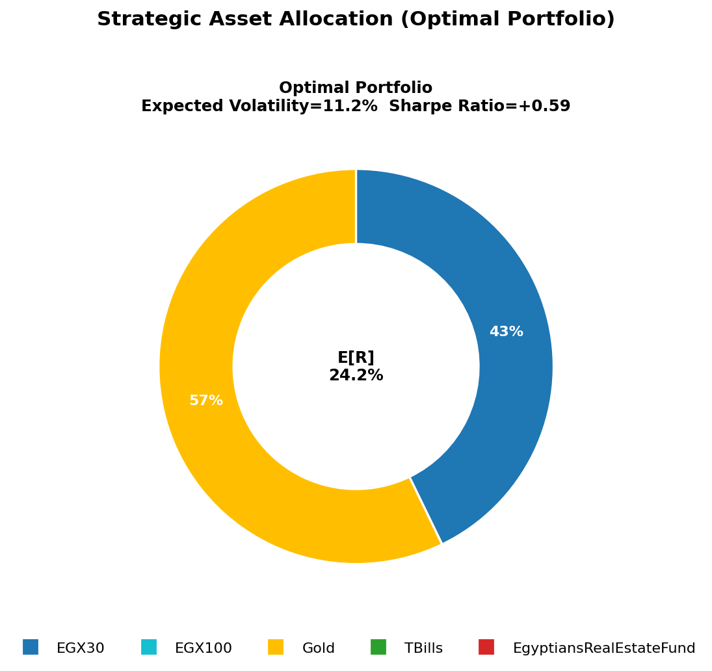

**Figure 15.** Optimal strategic weights by asset.

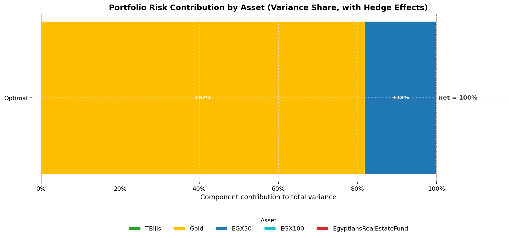

**Figure 16.** Marginal risk contributions for Optimal portfolio.

---

### 3.8 Monte Carlo Simulation and Risk Analytics

Two engines (`src/strategic/risk_models/monte_carlo.py`):

1. **Parametric Student-t** (df=6): multivariate draws preserving fat tails.
2. **Block bootstrap** (10-day blocks): preserves empirical autocorrelation.

**Horizon:** 252 trading days; **simulations:** 5,000; seed **7**.

**Latest Optimal portfolio MC (parametric):**

| Metric | Value |
|--------|-------|
| Expected CAGR | 26.39% |
| CAGR 5th percentile | 5.17% |
| CAGR 95th percentile | 52.11% |
| Downside probability | 1.82% |
| Expected max drawdown | -6.86% |
| Worst max drawdown | -11.71% |
| Target DD breach prob (25%) | 0.00% |

Bootstrap median CAGR: 21.12% — slightly lower tail than parametric, reflecting empirical clustering.

**Stress tests (backtest layer):** equity selloff (−20%), devaluation shock, rate spike scenarios reported per rebalance.

**[INSERT FIGURE 17: Monte Carlo terminal wealth distribution (Optimal portfolio, Student-t, 5,000 paths)]**

**Figure 17.** Monte Carlo terminal wealth distribution (Optimal portfolio, Student-t, 5,000 paths)

---

### 3.9 Validation and Backtesting

**Protocol:** Quarterly walk-forward rebalance (`BACKTEST_REBALANCE_FREQ = 'Q'`).

**Evaluation window:** {'start': '2026-01-01', 'end': '2026-05-31'}

**Chronology per segment:**

1. Train on `[start, rebalance_date − 1]`
2. Generate features, forecasts, covariance
3. Optimize weights; apply tactical overlay & risk controls
4. Hold through test segment; deduct **12 bps** turnover costs
5. Assert `train_end < test_start` (persisted in `leakage_checks`)

**Benchmarks:** EGX30, TBills, `EGX_TBills_60_40` (local 60/40), optional S&P 500.

---

### 3.10 Visualization Architecture

| Layer | Technology | Function |
|-------|------------|----------|
| **Batch analytics** | Python (`src/main.py`) | Generates JSON + plots |
| **API contract** | `src/api/service.py`, `schemas.py` | Structured payloads for UI |
| **Interactive web** | Next.js (`Code/interactive-platform/`) | Portfolio dashboard, tactical replay, custom backtests |
| **BI dashboard** | Power BI (3 pages) | Stakeholder-facing exploration of cleaned & engineered data |

The web platform reads `intelligence_report.json` fields: `strategic_profiles`, `tactical_signal`, `backtest`, `strategic_diagnostics`.

### 3.11 Extended Methodological Notes

#### 3.11.1 The Seven-Plot EDA Standard (Per-Asset Methodology)

To ensure comparability across notebooks, each asset underwent an identical visualization protocol. The table below summarizes analytical intent—EGX30 figures are shown above; Palm Hills, SODIC, TMG notebooks repeat the template for issuer-level equity research outside the five-asset optimizer.

| Plot # | Visualization | Analytical purpose | Representative EGX30 insight |
|--------|---------------|-------------------|------------------------------|
| 1 | Cumulative returns + volume | Long-horizon growth & liquidity | ~3× nominal growth 2015–2026 with volume spikes preceding major moves |
| 2 | Return histogram + KDE | Normality / fat tails | Leptokurtosis: extremes >2σ occur ~3× Gaussian frequency |
| 3 | Target class balance | Classification difficulty | Mild imbalance in binary EDA prototypes; tactical engine uses ternary quantile labels |
| 4 | Feature violin plots | Separability of Up/Down | RSI/MACD overlap → requires ensembles, not single rules |
| 5 | Feature correlation heatmap | Multicollinearity control | RSI ↔ bb_pb up to ρ≈0.87; weak feature–label linear correlation |
| 6 | 30-day rolling volatility | Regime clustering | σ shifts between ~15% calm and >40% crisis bands |
| 7 | Drawdown curve | Tail risk & recovery | Peak drawdown ~60% (2020); multi-month recovery cycles |

#### 3.11.2 General Cross-Sectional EDA (`00_General_Data_Cleaning.ipynb`)

The general notebook computes upper-triangular correlation masks on the **cleaned** multi-asset panel (pre-feature-engineering) and distributional statistics used to validate the EM panel. This step confirmed that forcing `dropna(how='any')` would collapse usable history to roughly **180 trading days**—motivating EM imputation in production.

#### 3.11.3 Mathematical Feature Definitions

Let \(P_t\) denote adjusted close price and \(r_t = P_t/P_{t-1} - 1\) daily simple return.

- **RSI (14):** With smoothed gains/losses \(\overline{G}, \overline{L}\), \(RS = \overline{G}/\overline{L}\), \(RSI = 100 - 100/(1+RS)\). Values >70 (overbought) and <30 (oversold) frame tactical mean-reversion hypotheses.
- **MACD histogram:** \(MACD = EMA_{12}(P) - EMA_{26}(P)\); signal \(EMA_9(MACD)\); histogram \(MACD - signal\). Captures acceleration/deceleration of trends.
- **Bollinger %B:** For MA\(_20\) and band width \(2\sigma\), \(%B = (P - lower)/(upper - lower)\). Values >1 or <0 indicate band pierces—often coincident with volatility expansions.
- **Distance to MA\(_5\):** \((P - MA_5)/MA_5\). Short-horizon mean-reversion distance measure used in both EDA and ML feature sets.
- **63-day forward target (strategic):** \(y_t = \prod_{i=1}^{63}(1+r_{t+i}) - 1\). Aligns optimization horizon with quarterly rebalance cadence.

#### 3.11.4 Label Construction and Signal Fusion

Tactical labels are defined on **forward one-day return quantiles** (33/67% thresholds), yielding balanced sell/hold/buy buckets over rolling history. The signal engine (`build_tactical_signal`) fuses:

1. **Classifier ensemble vote** (weighted by fold-stability-adjusted F1),
2. **Momentum snapshot** (short-horizon trend strength),
3. **Regime detector** (bull/bear/high-vol states),
4. **Strategic bias** (defensive vs bullish based on Gold+TBills vs EGX weights).

Disagreement across base learners triggers **confidence collapse**—observed in the latest run (`ensemble_disagreement: true`, confidence 7.8%).

#### Classifier benchmark table (holdout)

| Model | Accuracy | F1 (weighted) | Fold F1 σ |
|-------|----------|---------------|-----------|
| logistic_regression | 34.94% | 34.91% | 0.029614 |
| svm_rbf | 37.78% | 37.45% | 0.011521 |
| xgboost | 35.52% | 35.44% | 0.024947 |

#### Confusion matrix (ensemble)

| Actual \ Predicted | Sell (−1) | Hold (0) | Buy (+1) |
|-------------------|-----------|----------|----------|
| **Sell (−1)** | 337 | 266 | 245 |
| **Hold (0)** | 335 | 303 | 257 |
| **Buy (+1)** | 352 | 290 | 225 |

#### 3.11.5 Optimization Reference Points and Layer Fusion

Beyond tangency, the engine computes **minimum variance**, **equal risk contribution**, and **mean–variance utility** reference portfolios for diagnostic comparison. `src/portfolio/layer_interaction.py` applies an **inflation-aware tilt** matrix: when CPI regime is elevated, strategic rationale tilts narrative toward Gold and short-duration bills—visible in the Optimal profile `rebalancing_note`.

**SLSQP constraint set (summary):**

\[
\min_w \; -\frac{w^T\mu - R_f}{\sqrt{w^T\Sigma w}}
\quad \text{s.t.} \quad w \ge 0,\; \mathbf{1}^T w = 1,\; w_{EGX30} + w_{EGX100} \le 0.65
\]

Per-asset box constraints apply in mandate profiles but are **advisory** for unconstrained tangency research (`constraint_diagnostics.asset_bounds_ok: false` when floors are violated).

#### 3.11.6 Walk-Forward Segment Diagnostics

Walk-forward out-of-sample segments (`backtest.walk_forward_oos`) extend evidence beyond the headline evaluation window. Each rebalance publishes segment Sharpe, cumulative return, and leakage assertions. Latest leakage checks confirm **no train/test overlap** (e.g., train_end 2025-12-31, test_start 2026-01-01).

**Imputation diagnostics (EM):** {"iterations": 150, "converged": false, "final_delta": 1.5795113923672325e-06, "imputed_fraction": {"EGX30": 0.2146, "EGX100": 0.6306, "Gold": 0.8452, "TBills": 0.1287, "EgyptiansRealEstateFund": 0.917}, "imputation_residual_var": {"EGX30": 1.49e-06, "EGX100": 5.222e-05, "Gold": 7.75e-06, "TBills": 0.0, "EgyptiansRealEstateFund": 5.7e-06}}

#### 3.11.7 Interactive Web Platform Architecture

The Next.js application under `Code/interactive-platform/interactive-platform/` consumes the intelligence JSON API and exposes:

- **Strategic allocation cards** with weights, Sharpe, and rebalance calendar,
- **Tactical replay** (`tacticalReplay.ts`) for historical signal visualization,
- **Custom backtest** module (`customBacktest.ts`) allowing user-defined benchmark overlays,
- **IBKR-style portfolio stats** components for risk summaries.

This architecture decouples **compute** (Python batch) from **presentation** (TypeScript/React), enabling reproducible research artifacts without re-running optimization in the browser.

---

---

## 4. Results

### 4.1 Key EDA and Market Structure Findings

- **EGX30:** ann. mean 17.68%, ann. vol 21.72%, skew -0.23, kurtosis 4.14
- **EGX100:** ann. mean 0.49%, ann. vol 17.57%, skew -0.70, kurtosis 6.17
- **Gold:** ann. mean 40.25%, ann. vol 22.28%, skew -0.60, kurtosis 8.08
- **TBills:** ann. mean 16.13%, ann. vol 0.26%, skew 0.44, kurtosis -0.98
- **EgyptiansRealEstateFund:** ann. mean 22.38%, ann. vol 69.36%, skew 1.67, kurtosis 11.38

Gold exhibits the highest recent annualized mean among sleeves but with leptokurtic tails; T-Bills display near-zero volatility (σ ≈ 0.26%) consistent with carry-focused role. EGREF shows extreme kurtosis (>11) and stale-series flags—corroborating cautious optimizer weights.

### 4.2 Model Performance

#### 4.2.1 Strategic Regression (Walk-Forward)

The production ensemble prioritizes **stability over in-sample fit**. Median walk-forward R² values are negative for most asset–model pairs in the latest run, indicating forecasts are only marginally better than naïve baselines. The engine responds by **shrinking μ toward historical medians** and capping forecast deviation (`FORECAST_DEVIATION_CAP_ANNUAL = 4%`). This design choice prevents the optimizer from chasing spurious ML signals—a critical institutional safeguard.

**Illustrative 63-day model predictions (EGX30):** Ridge +3.37%, RF +19.21%, SVR +6.11% — blended and shrunk before daily μ insertion.

#### 4.2.2 Tactical Classification

| Metric | Value |
|--------|-------|
| Holdout size | 2610 |
| Accuracy | 33.14% |
| Precision (weighted) | 33.07% |
| Recall (weighted) | 33.14% |
| F1 (weighted) | 32.92% |
| Calibration error | 0.4695271657404824 |
| Ensemble disagreement | True |

**Interpretation:** For a balanced three-class problem, accuracy ≈ 33% is near the random baseline. The system's value lies not in directional “accuracy” alone but in **confidence-disciplined sizing**: current signal 0 with confidence 7.78% and **suggested exposure 81.67% under realized vol 22.04%. Regime = **bull_trend**; RSI PanelQualityScale=0.827.

Per-class F1 (sell/hold/buy): -1: 0.360, 0: 0.345, 1: 0.282.

### 4.3 Portfolio Optimization and Strategic Allocation

**Optimal tangency weights (latest):**

| Asset | Weight |
|-------|--------|
| EGX30 | 42.82% |
| EGX100 | 0.00% |
| Gold | 57.18% |
| TBills | 0.00% |
| EgyptiansRealEstateFund | 0.00% |

| Metric | Value |
|--------|-------|
| Ex-ante Sharpe (CMA) | 0.5854 |
| Expected return (CMA) | 24.17% |
| Expected volatility | 11.21% |
| Diversification ratio | 1.7717 |

**Financial interpretation:** With \(R_f \approx\) 17.61%, the optimizer concentrates in **Gold (~57.18%)** and **EGX30 (~42.82%)**—the combination offering the best risk-adjusted spread given negative equity–gold correlation and high bill yields that penalize idle cash unless constrained. Zero weight in T-Bills and REIT reflects **tangency logic** (not mandate floors) and REIT data-quality penalties.

Risk contributions: Gold 81.88% of total portfolio risk despite moderate weight—consistent with volatility differential.

### 4.4 Walk-Forward Backtest and Benchmarks

**Window:** {'start': '2026-01-01', 'end': '2026-05-01'}

| Strategy | Total Return | CAGR | Volatility | Sharpe | Max DD |
|----------|--------------|------|------------|--------|--------|
| **Optimal (walk-forward)** | 23.37% | 66.33% | 29.56% | 1.2744 | -11.79% |
| EGX30 | 29.62% | 87.52% | 22.81% | 2.0999 | -13.64% |
| T-Bills | 9.21% | 23.79% | 0.15% | 24.2785 | 0.00% |
| EGX/T-Bills 60/40 | 21.35% | 59.81% | 13.69% | 2.2082 | -7.58% |

**Interpretation:** The short evaluation window (early 2026) produces elevated CAGR estimates for all series—readers should treat magnitudes as **illustrative of relative ordering**, not long-horizon promises. Optimal achieves **lower max drawdown (−11.8%)** than EGX30 (−13.6%) with information ratio ≈ 0.22 vs local 60/40. Tactical history shows risk-off deleveraging (position size 30%) at the March 2026 rebalance when vol breach triggered.

**USD-real metrics:** Optimal USD-real CAGR 139.05% highlights gold-linked hedge behavior under parallel FX synthesis (USD/EGP ≈ 48.5459).

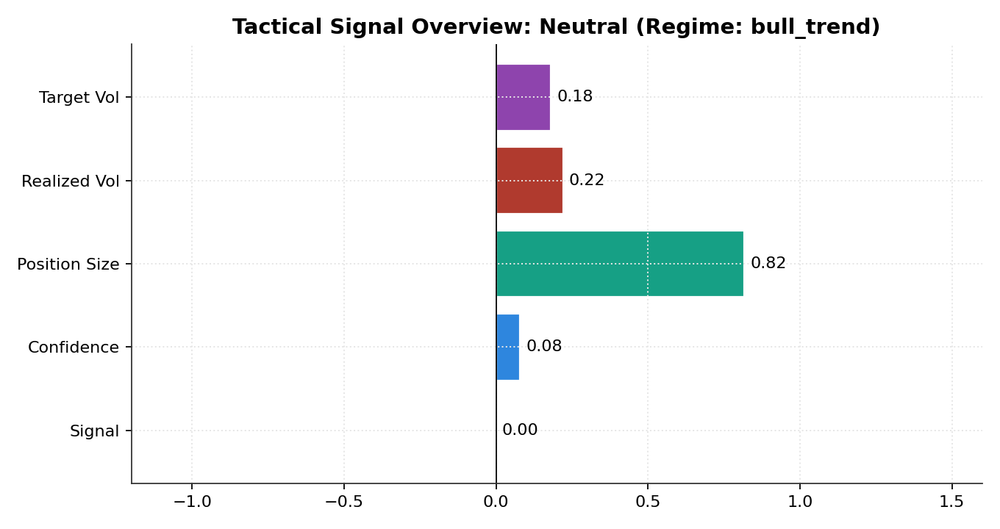

**Figure 18.** Tactical signal, confidence, and volatility-targeting diagnostics.

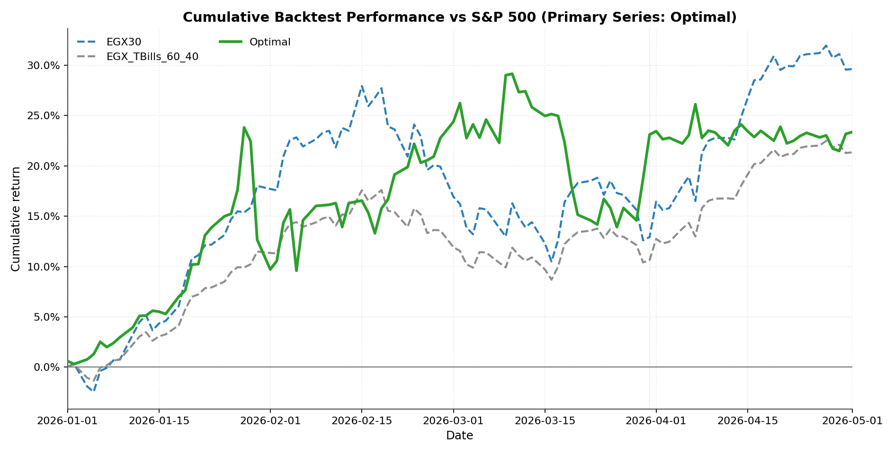

**Figure 19.** Cumulative return curves — Optimal vs benchmarks.

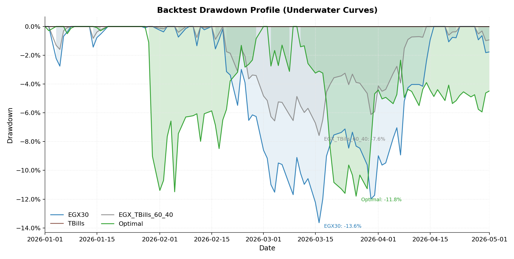

**Figure 20.** Underwater drawdown comparison.

### 4.5 Monte Carlo and Tail-Risk Interpretation

Parametric Student-t simulation implies **limited probability of negative 1-year CAGR (1.8%)** for the Optimal mix, yet **worst-case drawdown paths near −11.7%**—consistent with embedded equity and gold volatility. Bootstrap simulations yield slightly lower median terminal wealth, affirming sensitivity to historical clustering. Neither engine captures **sovereign gap risk** or **closed FX markets**; tail scenarios should be supplemented with qualitative stress narratives (devaluation shock P&L +5.94% one-day proxy vs rate spike −4.85% in latest stress table).

### 4.6 Supplementary Results and Diagnostics

### 4.6.1 Equity Single-Name EDA (Non-Optimizer Assets)

Notebooks `03_EDA_Palm_Hills`, `04_EDA_Sodic`, and `05_EDA_TMG` extend the seven-plot protocol to liquid real-estate developers. These analyses informed sector concentration risks but were **excluded from STRATEGIC_UNIVERSE** to maintain investable index/fund sleeves with reproducible macro exposure. Extracted plots reside in `outputs/plots/eda_extracted/03_*`, `04_*`, `05_*`.

### 4.6.2 T-Bill and Gold Specialized Diagnostics

`07_EDA_Tbills.ipynb` confirms the vendor yield series is **not** a return series—validating the Ornstein–Uhlenbeck synthetic carry feed. `06_EDA_Gold.ipynb` documents shorter history (from mid-2024) and justifies EM completion for covariance estimation.

### 4.6.3 Model Risk Controls (Governance)

Per `metadata.model_risk_controls`:

- **Strategic:** Constrained frontier constructions; Monte Carlo scoring; constraint diagnostics on each allocation.
- **Tactical:** Time-ordered CV, class-imbalance gate, fold-F1 stability, calibration dampeners, ensemble disagreement penalty, panel-QA confidence scaling (metadata-only; no mutation of raw prices).
- **Backtest:** Walk-forward segments with persisted leakage checks.

Institutional risk limits (`metadata.institutional_risk_limits`) declare max leverage 1.0×, vol-breach factor 1.25×, and stress scenarios (equity selloff, devaluation shock, rate spike).

### 4.6.4 Reconciliation with Interim Report Metrics

The interim PDF reported higher in-sample Linear Regression \(R^2 \approx 0.93\) on EGX30/Gold. The production engine deliberately reports **negative median walk-forward \(R^2\)** for the same asset class after applying train-only winsorization and expanding-window CV. **We treat the production metrics as authoritative** for this final report; interim figures are retained only as evidence of exploratory overfitting risk.

---

## 5. Conclusions

### 5.1 Summary of Findings

We delivered a **reproducible, auditable** multi-layer investment stack for Egyptian multi-asset allocation combining:

- Rigorous data engineering (11-step CSV pipeline + EM panel completion + T-Bill carry fix)
- Leakage-aware ML (walk-forward regression & classification)
- Tangency-based strategic optimization with explicit risk diagnostics
- Monte Carlo tail analytics and walk-forward backtesting

Empirically, **Gold–equity diversification** and **high real bill yields** dominate the current optimal mix, while tactical modules rationally **withhold conviction** when ensemble disagreement and volatility breaches erode edge.

### 5.2 Recommendations

1. **Strategic anchor:** Implement Optimal tangency weights as the baseline policy, rebalanced quarterly.
2. **Tactical overlay:** Keep volatility targeting enabled; respect sub-unity position sizes during `vol_breach` regimes.
3. **Governance:** Monitor `imputed_fraction` per asset; require manual sign-off when Gold/REIT imputation exceeds 35%.
4. **Cash & bills:** For mandate-driven portfolios, apply `PROFILE_BOUNDS` floor constraints in a separate “Regulated” profile alongside unconstrained tangency research.
5. **Visualization:** Maintain Power BI for exploratory review; use JSON-fed web dashboard for production analytics.

### 5.3 Limitations

- EM-imputed histories introduce **model uncertainty** for pre-2024 Gold and sparse REIT windows.
- Walk-forward ML skill is weak (negative R²); forecasts are intentionally shrunk.
- Backtest window is short; transaction cost model (12 bps) omits stamp duty, spreads, and liquidity halts.
- Synthetic FX/CPI feeds approximate macro paths but are not exchange-traded instruments.
- Tangency Optimal may violate advisory mandate floors—documented in `constraint_diagnostics`.

### 5.4 Future Work

- **Deep learning:** LSTM/Temporal Fusion Transformers for sequential return forecasting.
- **Reinforcement learning:** PPO agents for turnover-aware allocation.
- **Macro data:** Live CBE auction feeds, parallel FX, high-frequency inflation scrapes.
- **Execution:** Broker FIX integration, paper-trading sandbox, Islamic finance constraints.
- **Visualization:** On-demand ROC/confusion exports in `report_plots.py`; expand drift baseline automation.

---

## 6. Acknowledgements

We sincerely thank **Dr. Fatema ElShahaby** and **Dr. Malak Khaled** for their guidance, feedback, and support throughout CSE271. We acknowledge the **Egypt University of Informatics** for academic resources enabling this capstone.

We thank the open-source communities behind **Python**, **pandas**, **NumPy**, **SciPy**, **scikit-learn**, **XGBoost**, **Matplotlib**, **Seaborn**, **FastAPI**, and **Next.js**, without which this system could not be reproduced. Market data were sourced via **investing.com** with validation from **EGX** and **Yahoo Finance** as described in Section 3.1.

---

## 7. References

Black, F., & Litterman, R. (1992). Global portfolio optimization. *Financial Analysts Journal*, *48*(5), 28–43.

Breiman, L. (2001). Random forests. *Machine Learning*, *45*(1), 5–32.

Central Bank of Egypt. (2024). *Monetary policy reports and auction statistics*. https://www.cbe.org.eg

Chan, E. P. (2013). *Algorithmic trading: Winning strategies and their rationale*. John Wiley & Sons.

Chen, T., & Guestrin, C. (2016). XGBoost: A scalable tree boosting system. In *Proceedings of the 22nd ACM SIGKDD* (pp. 785–794).

Dempster, A. P., Laird, N. M., & Rubin, D. B. (1977). Maximum likelihood from incomplete data via the EM algorithm. *Journal of the Royal Statistical Society: Series B*, *39*(1), 1–38.

Dixon, M. F., Halperin, I., & Bilokon, P. (2020). *Machine learning in finance: From theory to practice*. Springer.

Faber, M. T. (2007). A quantitative approach to tactical asset allocation. *The Journal of Wealth Management*, *9*(4), 69–79.

Grinold, R. C., & Kahn, R. N. (1999). *Active portfolio management* (2nd ed.). McGraw-Hill.

Gu, S., Kelly, B., & Xiu, D. (2020). Empirical asset pricing via machine learning. *The Review of Financial Studies*, *33*(5), 2223–2273.

International Monetary Fund. (2023). *Arab Republic of Egypt: Article IV consultation*. IMF Country Report.

Katz, J. O., & McCormick, D. L. (2000). *The encyclopedia of trading strategies*. McGraw-Hill.

López de Prado, M. (2018). *Advances in financial machine learning*. John Wiley & Sons.

Markowitz, H. (1952). Portfolio selection. *The Journal of Finance*, *7*(1), 77–91.

Narang, R. K. (2013). *Inside the black box* (2nd ed.). John Wiley & Sons.

Schafer, J. L. (1997). *Analysis of incomplete multivariate data*. Chapman & Hall/CRC.

Sharpe, W. F. (1964). Capital asset prices: A theory of market equilibrium under conditions of risk. *The Journal of Finance*, *19*(3), 425–442.

---

*End of Technical Report — generated from repository sources (`intelligence_report.json`, `docs/METHODOLOGY.md`, `DATA_SCIENCE_Report (1).pdf`) and aligned to engine semantic version 0.3.0.*

---

## Appendix A — AI Usage Disclosure (CSE271 Policy)

| Instance | Tool | Purpose | Human refinement |
|----------|------|---------|------------------|
| 1 | ChatGPT | Power BI learning roadmap | Team validated dashboard against notebook statistics |
| 2 | Gemini | Monte Carlo implementation guidance | Parameters calibrated to Egyptian volatility; validated via `validate_quant.py` |
| 3 | ChatGPT | APA reference formatting | Manual verification of DOIs and years |
| 4 | Claude | Dataset formation troubleshooting | All fixes audited in `00_General_Data_Cleaning.ipynb` |

No large language model generated production Python modules without human review. Final methodology, anti-leakage policy, and numerical results are grounded in executable repository code and `intelligence_report.json`.

## Appendix B — Repository Artifact Index

| Path | Description |
|------|-------------|
| `data/final_data/*.csv` | Model-ready cleaned panels |
| `outputs/intelligence_report.json` | Full audit payload |
| `outputs/plots/eda_extracted/` | Notebook-exported EDA figures |
| `dashboard_page_images/` | Power BI page screenshots |
| `docs/METHODOLOGY.md` | Signed methodology reference |
| `docs/TECHNICAL_AUDIT.md` | Remediation log |
| `scripts/build_technical_report_final.py` | This report generator |
